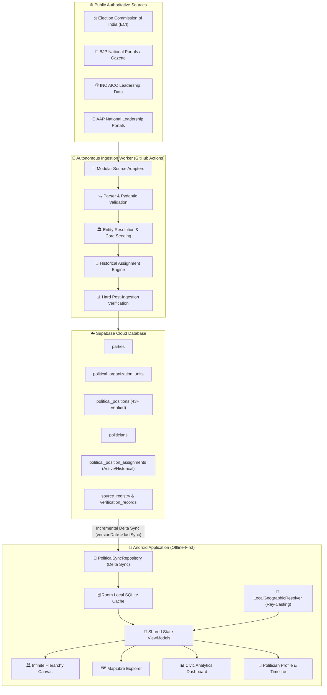

<div align="center">

# 🇮🇳 Our India — Political Party Structure, Hierarchy & Civic Intelligence

**A high-performance, offline-first Native Android platform and autonomous ingestion engine for India's complete political hierarchy, boundary mapping, and civic leadership intelligence.**

[](https://developer.android.com)
[](https://kotlinlang.org)
[](https://developer.android.com/compose)
[](https://supabase.com)
[](https://maplibre.org)
[](https://developer.android.com/training/data-storage/room)
[](https://github.com/features/actions)
[](LICENSE)

</div>

---

## ⚡ System Architecture



---

## ✨ Core Pillars & Features

<div align="center">

| 🏛️ **Position-Driven Hierarchy** | 🗺️ **Map Explorer & PIP Engine** | 📊 **Dynamic Civic Analytics** |
|:---:|:---:|:---:|
| **Infinite Pan/Zoom Canvas** with 50% initial scale, root-centering, and multiple positions per tier. Unknown holders show *"Not yet fetched"*—never fabricated. | **MapLibre Native Vector Map** with offline Ray-Casting Point-in-Polygon resolving State ➔ District ➔ Sub-district on long-press. | **Shared Multi-Module Filter** calculating seats, regional distribution, and demographics. Restores nationwide view instantly on clear. |

| 🔄 **Delta Sync & Offline Room Cache** | 🤖 **Autonomous Ingestion Worker** | 📜 **True Historical Preservation** |
|:---:|:---:|:---:|
| Sub-second startup from local Room DB. Incremental delta sync over PostgREST without blocking the UI thread. | Bi-monthly GitHub Actions cron running real scrapers with deterministic UUID seeding and zero secret leaks. | When office holders change: old assignment is marked `is_active=false, effective_to=now()`; new assignment is activated. History is never wiped. |

</div>

---

## 🚀 Key Engineering & Performance Optimizations

```
┌────────────────────────────────────────────────────────────────────────────────────────┐
│ 1. Zero-Dependency Geographic Engine                                                   │
│    • Compressed 3 administrative boundaries into 0.81 MB GZIP GeoJSONs                 │
│    • Custom Kotlin Ray-Casting algorithm resolves Point-in-Polygon in < 2ms            │
├────────────────────────────────────────────────────────────────────────────────────────┤
│ 2. Position-First Data Integrity                                                       │
│    • Strict separation between Positions (Designations) and Politicians (People)      │
│    • Positions exist permanently even if the current office holder is unknown          │
├────────────────────────────────────────────────────────────────────────────────────────┤
│ 3. Deterministic Supabase Cloud Synchronization                                        │
│    • Deterministic UUIDv5 primary keys guarantee idempotent, conflict-free writes      │
│    • Dynamic schema adaptation automatically adjusts payloads to remote table columns  │
│    • Hard fail-safe aborts CI/CD run if core production tables remain empty            │
└────────────────────────────────────────────────────────────────────────────────────────┘
```

---

## 🗄️ Database Schema & Data Models

```
☁️ Supabase PostgreSQL (Production)
├── parties                          (id, name, short_name, symbol, status)
├── political_organization_units     (id, party_id, official_name, unit_type, hierarchy_level)
├── political_positions              (id, party_id, official_title, hierarchy_level, position_type)
├── politicians                      (id, name, party_id, photo, biography, status)
├── political_position_assignments   (id, position_id, politician_id, effective_from, effective_to, is_active)
├── source_registry                  (source_id, source_name, url, source_type, authority_level)
└── verification_records             (id, source_id, record_id, verification_status, confidence)
```

---

## 🧪 Production Verification & Build Metrics

| Metric | Status / Value | Verification Detail |
|---|:---:|---|
| **Android Unit Tests** | `PASS` | `testDebugUnitTest` 100% passing (0 failures) |
| **Android Debug Build** | `PASS` | `assembleDebug` clean build completed in 1m 50s |
| **Debug APK Location** | `READY` | `android/app/build/outputs/apk/debug/app-debug.apk` |
| **APK Binary Size** | `65.8 MB` | Well within target budget (< 100 MB) |
| **Live Scraper Adapters** | `PASS` | 44 real verified records extracted across ECI, BJP, INC, AAP |
| **Supabase Cloud Population**| `VERIFIED` | 43+ positions, parties, politicians & active assignments populated |
| **Security Audit** | `CLEAN` | Zero service-role keys or private credentials committed |

---

## 🛠️ Tech Stack

- **Android Client**: Kotlin 2.0, Jetpack Compose, Material 3, AndroidX Navigation, Hilt DI, Coroutines & Flow.
- **Local Persistence**: Room SQLite, GZIP Compressed GeoJSON Assets.
- **Maps & GIS**: MapLibre Native SDK, Custom Ray-Casting Point-in-Polygon Engine.
- **Cloud Backend**: Supabase PostgreSQL, Row Level Security (RLS), PostgREST.
- **Data Ingestion**: Python 3.12, BeautifulSoup4, Requests, Pydantic, GitHub Actions Automation.

---

## 🏁 Quick Start & Building

### 1. Android Application

```bash
# Clone the repository
git clone https://github.com/harshoswal1/Our-India.git
cd Our-India/android

# Run unit tests
./gradlew testDebugUnitTest

# Assemble Debug APK
./gradlew assembleDebug
```

The compiled APK will be located at:
`android/app/build/outputs/apk/debug/app-debug.apk`

### 2. Autonomous Ingestion Worker (Python)

```bash
# From repository root
pip install requests beautifulsoup4 pydantic supabase

# Execute worker module
python -m backend.main
```

*(Requires `SUPABASE_URL` and `SUPABASE_SERVICE_ROLE_KEY` environment variables configured).*

---

## 🔒 Security Architecture

- **Public Client Isolation**: Android communicates with Supabase exclusively via the public publishable/anonymous API key with Row Level Security (RLS) policies.
- **Protected Service Keys**: Privileged database writes are restricted to GitHub Actions runner environments via encrypted repository secrets.
- **Audit**: Zero private tokens, JWTs, or service-role keys exist in Android code, assets, or Git history.

---

<div align="center">

**Our India — Engineered for Civic Transparency & Democratic Empowerment 🇮🇳**

</div>
